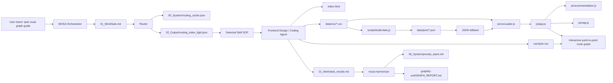

# Ipoh Travel MOSA Graph Report

Generated: 2026-06-02
Workspace: Ipoh_Travel

## God Nodes

- `AGENTS.md`: workspace Token Shield instructions.
- `graphify-out/GRAPH_REPORT.md`: project topology entrypoint.
- `index.html`: static app shell and route explorer DOM anchors.
- `contribute.html`: manual-review contribution draft page.
- `data/csv/`: editable CSV source of truth.
- `data/json/`: generated browser data.
- `js/app.js`: rendering, filtering, selection, graph interaction.
- `js/map.js`: Leaflet map setup with tile fallback.
- `js/recommendation.js`: distance and route scoring logic.
- `js/i18n.js`: bilingual language toggle.
- `js/csvLoader.js`: CSV-first browser loading with JSON fallback.
- `css/style.css`: light UI and interactive graph presentation.
- `scripts/build-data.js`: CSV-to-JSON generator.
- `scripts/validate-data.js`: CSV validation gate.
- `docs/`: deployment, data, contribution and BAS.MY workflow notes.
- `README.md`: deployment and data-source guidance.
- `README.md`: deployment and data-source guidance.
- `00_System/`: long-term workspace memory and state.
- `01_Work/`: current task trace and handoff files.
- `02_Output/`: generated summaries and routing support.

## Mermaid Topology

## Token Shield Rule

When asked about architecture, data flow, graph behavior, routing, or deployment:

1. Read `AGENTS.md`.
2. Read this `graphify-out/GRAPH_REPORT.md`.
3. Use God Nodes as the search boundary.
4. Prefer `index.html`, `js/`, `css/style.css`, and `data/csv/` over broad scans.
5. Use `01_Work/context_bus.json` for current-task handoff.
6. Use `00_System/prompt_stack.md` for durable decisions.

## Current Efficiency Notes

- Static app only: no backend, no login, no framework.
- Leaflet CDN is used only for map display.
- `data/csv/` is the canonical data source.
- `data/json/` is generated by `scripts/build-data.js` and kept as fallback.
- `js/csvLoader.js` loads CSV first and falls back to generated JSON if CSV is unavailable.
- `js/app.js` normalizes UI state and renders filters/cards.
- `js/recommendation.js` scores route links by manual links, distance, time and category.
- Route graph uses point-to-point interactive HTML nodes.
- Bus stops marked `map_inferred` or `needs_verification` are not official GPS claims.
- Sponsors never affect ranking.
- `code_artifact.html` is a reference artifact, not the main implementation.
- Router proof is tool-generated in `01_Work/routing_result.json`.
- Latest Router status is `success`, not `reconstructed`.
- Registry Distiller reported 212 registered skills, 0 missing files, 0 collisions, 0 orphans.

## Startup Pointers

- App shell: `index.html`
- Data model: `data/csv/` and `data/json/`
- Graph logic: `js/app.js` and `js/recommendation.js`
- Map logic: `js/map.js`
- UI theme: `css/style.css`
- Deployment notes: `README.md`
- Current task trace: `01_Work/task.md`
- Current result trace: `01_Work/task_results.md`
- Router audit: `01_Work/routing_result.json`
- Activation log: `01_Work/Agent_Activation_Log.md`
- Durable memory: `00_System/prompt_stack.md`
- Routing cache: `00_System/routing_cache.json`
- Light routing index: `02_Output/routing_index_light.json`
- Registry report: `02_Output/registry_distiller_report.md`
